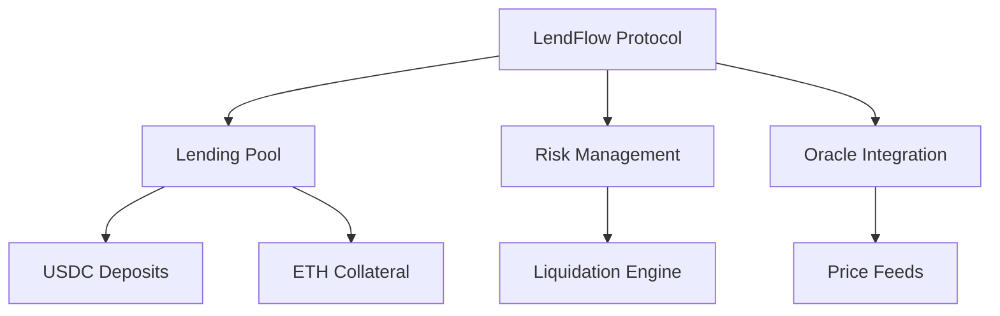

# LendFlow Smart Contract Architecture Analysis

### Core Architecture Overview



### Smart Contract Components

1. **Core Contracts**
```solidity
// Main protocol contract
contract LendFlow {
    // Core state variables
    mapping(address => uint256) public usdcDeposits;
    mapping(address => uint256) public ethCollateral;
    mapping(bytes32 => Loan) public loans;
    
    struct Loan {
        address borrower;
        uint256 usdcAmount;
        uint256 ethCollateral;
        uint256 startTime;
        uint256 endTime;
        uint256 interestRate;
        LoanStatus status;
    }
    
    enum LoanStatus { ACTIVE, REPAID, LIQUIDATED }
}

// Lending pool management
contract LendingPool {
    struct Pool {
        uint256 totalUsdc;
        uint256 availableUsdc;
        uint256 utilizationRate;
        uint256 currentYield;
    }
}

// Risk management
contract RiskManager {
    struct RiskParameters {
        uint256 minCollateralRatio;
        uint256 liquidationThreshold;
        uint256 maxUtilizationRate;
    }
}
```

### Key Architectural Decisions

1. **Pool Architecture**
```solidity
contract LendingPool {
    // Single pool vs multiple pools decision
    struct PoolInfo {
        uint256 totalDeposits;
        uint256 totalBorrows;
        uint256 reserveFactor;
        uint256 utilizationRate;
    }
    
    // Interest rate model
    function calculateInterestRate(uint256 utilization) public pure returns (uint256) {
        // Base rate + utilization factor
        return baseRate + (utilization * utilizationFactor) / SCALE;
    }
    
    // Yield distribution
    function distributeYield() internal {
        uint256 yield = calculatePoolYield();
        uint256 reserveShare = (yield * reserveFactor) / SCALE;
        uint256 lenderShare = yield - reserveShare;
        // Distribute to lenders based on their share
    }
}
```

2. **Risk Management System**
```solidity
contract RiskManager {
    // Liquidation thresholds
    uint256 public constant MINIMUM_COLLATERAL_RATIO = 150; // 150%
    uint256 public constant LIQUIDATION_THRESHOLD = 130; // 130%
    
    // Health factor calculation
    function calculateHealthFactor(
        uint256 collateralValue,
        uint256 loanValue
    ) public pure returns (uint256) {
        return (collateralValue * SCALE) / loanValue;
    }
    
    // Liquidation check
    function requiresLiquidation(bytes32 loanId) public view returns (bool) {
        Loan memory loan = loans[loanId];
        uint256 healthFactor = calculateHealthFactor(
            getCollateralValue(loan.ethCollateral),
            loan.usdcAmount
        );
        return healthFactor < LIQUIDATION_THRESHOLD;
    }
}
```

3. **Oracle Integration**
```solidity
contract PriceOracle {
    AggregatorV3Interface public ethUsdPriceFeed;
    
    function getEthPrice() public view returns (uint256) {
        (, int256 price,,,) = ethUsdPriceFeed.latestRoundData();
        require(price > 0, "Invalid price");
        return uint256(price);
    }
    
    function getCollateralValue(
        uint256 ethAmount
    ) public view returns (uint256) {
        uint256 ethPrice = getEthPrice();
        return (ethAmount * ethPrice) / 1e18;
    }
}
```

### Security Considerations

1. **Access Control**
```solidity
contract LendFlow is Ownable, ReentrancyGuard {
    // Role-based access control
    bytes32 public constant ADMIN_ROLE = keccak256("ADMIN_ROLE");
    bytes32 public constant OPERATOR_ROLE = keccak256("OPERATOR_ROLE");
    
    modifier onlyAdmin() {
        require(hasRole(ADMIN_ROLE, msg.sender), "Not admin");
        _;
    }
    
    // Circuit breaker
    bool public paused;
    
    modifier whenNotPaused() {
        require(!paused, "Contract paused");
        _;
    }
}
```

2. **Safety Checks**
```solidity
contract LendFlow {
    // Input validation
    modifier validLoanAmount(uint256 amount) {
        require(amount >= minLoanAmount, "Below minimum");
        require(amount <= maxLoanAmount, "Exceeds maximum");
        _;
    }
    
    // Reentrancy protection
    modifier nonReentrant() {
        require(!locked, "Reentrant call");
        locked = true;
        _;
        locked = false;
    }
    
    // State validation
    modifier validLoanState(bytes32 loanId) {
        require(loans[loanId].status == LoanStatus.ACTIVE, "Invalid loan state");
        _;
    }
}
```

### Core Functions Analysis

1. **Deposit Function**
```solidity
function deposit(
    uint256 amount
) external nonReentrant whenNotPaused returns (uint256) {
    // Validation
    require(amount > 0, "Zero amount");
    require(amount <= maxDepositAmount, "Exceeds max");
    
    // Calculate shares
    uint256 shares = (amount * totalShares) / totalDeposits;
    if (totalDeposits == 0) shares = amount;
    
    // Transfer USDC
    require(usdc.transferFrom(msg.sender, address(this), amount), "Transfer failed");
    
    // Update state
    totalDeposits += amount;
    userShares[msg.sender] += shares;
    
    emit Deposit(msg.sender, amount, shares);
    return shares;
}
```

2. **Borrow Function**
```solidity
function borrow(
    uint256 usdcAmount
) external payable nonReentrant whenNotPaused validLoanAmount(usdcAmount) {
    // Calculate required collateral
    uint256 requiredCollateral = calculateRequiredCollateral(usdcAmount);
    require(msg.value >= requiredCollateral, "Insufficient collateral");
    
    // Create loan
    bytes32 loanId = keccak256(abi.encodePacked(
        msg.sender,
        block.timestamp,
        usdcAmount
    ));
    
    loans[loanId] = Loan({
        borrower: msg.sender,
        usdcAmount: usdcAmount,
        ethCollateral: msg.value,
        startTime: block.timestamp,
        endTime: block.timestamp + LOAN_DURATION,
        interestRate: calculateInterestRate(getUtilizationRate()),
        status: LoanStatus.ACTIVE
    });
    
    // Transfer USDC
    require(usdc.transfer(msg.sender, usdcAmount), "Transfer failed");
    
    emit LoanCreated(loanId, msg.sender, usdcAmount, msg.value);
}
```

3. **Liquidation Function**
```solidity
function liquidate(
    bytes32 loanId
) external nonReentrant whenNotPaused validLoanState(loanId) {
    Loan storage loan = loans[loanId];
    
    // Check liquidation conditions
    require(requiresLiquidation(loanId), "Not liquidatable");
    
    // Calculate liquidation amounts
    uint256 repayAmount = calculateRepayAmount(loan);
    uint256 liquidationBonus = calculateLiquidationBonus(loan);
    
    // Transfer USDC from liquidator
    require(usdc.transferFrom(msg.sender, address(this), repayAmount), "Transfer failed");
    
    // Transfer ETH to liquidator
    (bool sent,) = msg.sender.call{value: loan.ethCollateral}("");
    require(sent, "ETH transfer failed");
    
    loan.status = LoanStatus.LIQUIDATED;
    
    emit LoanLiquidated(loanId, msg.sender, repayAmount, loan.ethCollateral);
}
```

### Optimization Considerations

1. **Gas Optimization**
```solidity
contract LendFlow {
    // Use uint256 instead of uint8/uint16
    // Pack similar-sized state variables
    struct LoanCompact {
        uint128 usdcAmount;
        uint128 ethCollateral;
        uint64 startTime;
        uint64 endTime;
        uint16 interestRate;
        uint8 status;
    }
    
    // Batch operations where possible
    function batchRepay(bytes32[] calldata loanIds) external {
        uint256 length = loanIds.length;
        for (uint256 i = 0; i < length;) {
            _repay(loanIds[i]);
            unchecked { ++i; }
        }
    }
}
```

2. **Storage Optimization**
```solidity
contract LendFlow {
    // Use events for historical data
    event LoanUpdate(
        bytes32 indexed loanId,
        uint256 amount,
        uint256 timestamp
    );
    
    // Use mappings instead of arrays
    mapping(bytes32 => Loan) public loans;
    mapping(address => mapping(uint256 => bytes32)) public userLoans;
}
```

### Testing Strategy

1. **Unit Tests**
```javascript
describe("LendFlow", function() {
    describe("Deposit", function() {
        it("Should accept USDC deposits", async function() {
            // Test deposit functionality
        });
        
        it("Should calculate shares correctly", async function() {
            // Test share calculation
        });
    });
    
    describe("Borrow", function() {
        it("Should require sufficient collateral", async function() {
            // Test collateral requirements
        });
        
        it("Should create loan correctly", async function() {
            // Test loan creation
        });
    });
});
```

2. **Integration Tests**
```javascript
describe("LendFlow Integration", function() {
    it("Should handle full loan lifecycle", async function() {
        // Deposit
        // Borrow
        // Repay
        // Withdraw
    });
    
    it("Should handle liquidation correctly", async function() {
        // Create loan
        // Manipulate price
        // Liquidate
    });
});
```
